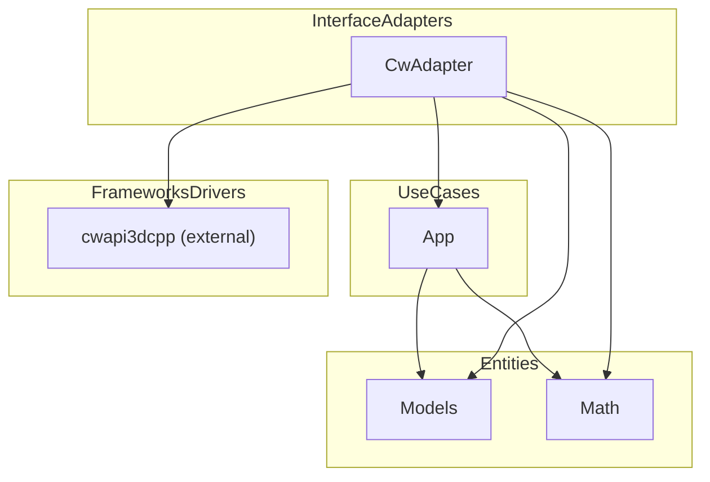

# Project Architecture

**Explanation:**
- **Entities:** `Models`, `Math` (domain objects, exceptions, dimensions, etc.)
- **Use Cases:** `App` (application logic, services)
- **Interface Adapters:** `CwAdapter` (adapts app logic to external API)
- **Frameworks/Drivers:** `cwapi3dcpp` (external API)

Arrows show allowed dependencies:
- Inner layers do not depend on outer layers.
- Adapters depend on use cases and entities.
- Frameworks/drivers depend on everything.
